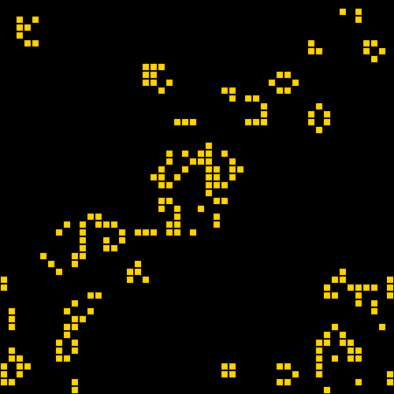

# Rust [Conway's Game of Life](https://en.wikipedia.org/wiki/Conway%27s_Game_of_Life)
  
* Сlassic rules devised by John Conway in 1970
* Life evolves on the surface of toroidal universe
* 2D game engine [ggez](https://ggez.rs/) shows these rules in action
* Use left mouse button to populate or right mouse button to free cells

---
## Getting started
First of all, install [rustup](https://www.rust-lang.org/tools/install) and check if everything is installed correctly by typing these two commands (their output may be different):
```
$ rustc --version
rustc 1.56.1
$ cargo --version
cargo 1.56.1
```
Then, just run the code by cloning the source and executing `cargo run` command in the root directory:
```
$ git clone https://github.com/MikhailUskin/rust-game-of-life.git
$ cd rust-game-of-life
$ cargo run
```
